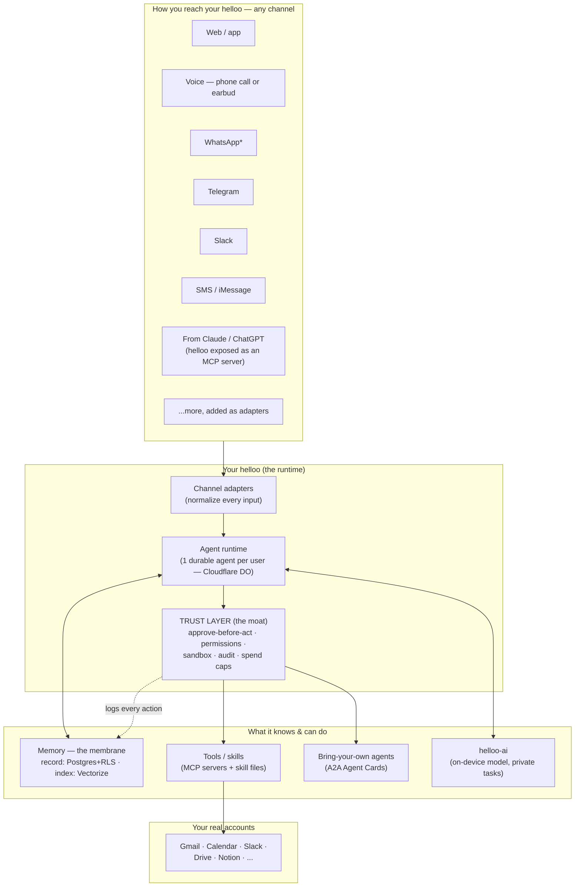
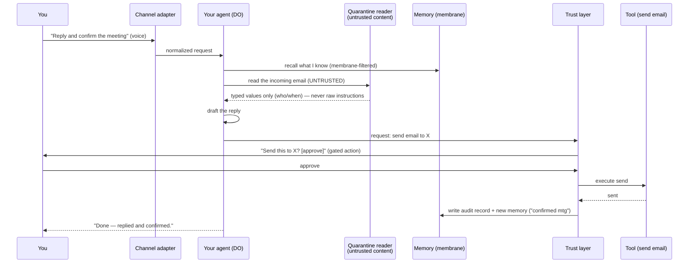
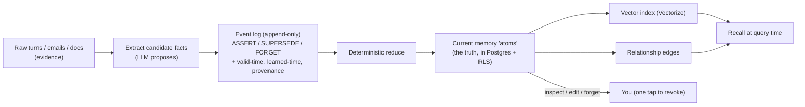
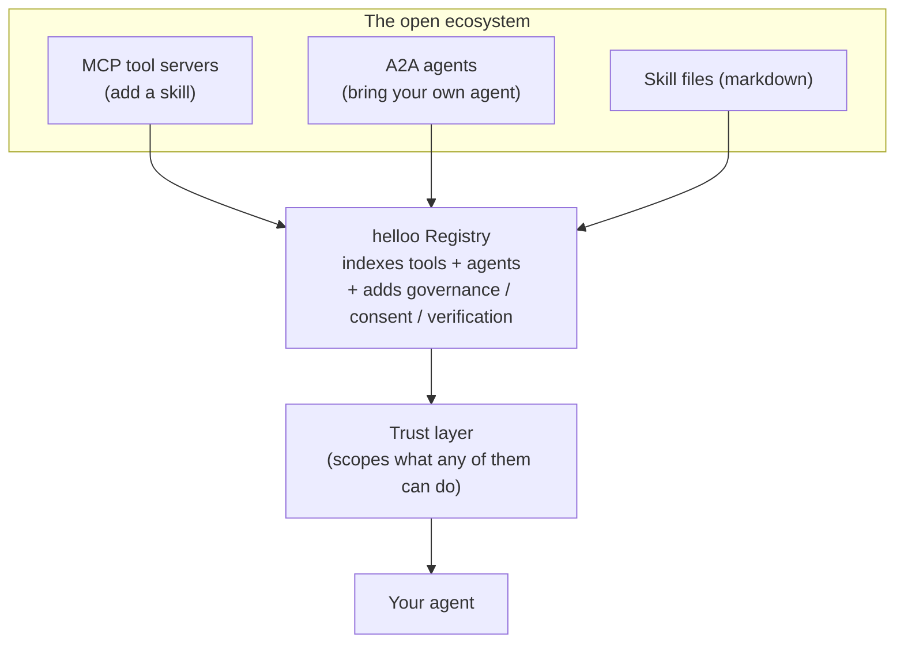
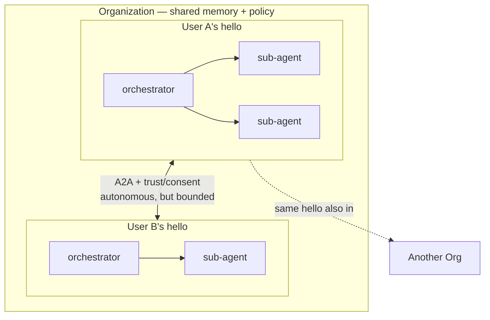
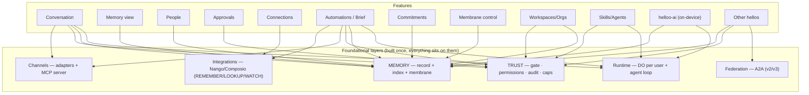

# helloo — System Map

> How helloo works, end to end, **before any new code is written**. Plain-language first, diagrams second. This is a *map to argue with* — engineers, please open issues / PRs / inline comments on anything that's wrong or over-built. Companion: [`docs/ARCHITECTURE.md`](docs/ARCHITECTURE.md) (the decisions + why) and [`QUESTIONS.md`](QUESTIONS.md) (what we're unsure about).

---

## 1. The idea in one breath

A person has **one AI ("their helloo")**. It **remembers** things they own and control (the *membrane*), it can **act** across their real accounts but only *safely* (it asks before doing anything consequential), and they can reach it **from anywhere** — an app, WhatsApp, a phone call, Telegram, Slack, an earbud, or from inside Claude/ChatGPT. Developers can give it **new skills** (tools) or plug in **their own agents**. We open-source the core and run the trusted hosted version.

## Example use cases (day-one scenarios)

These are the concrete things a person does with their helloo — used to keep the architecture honest (every one must be *possible and safe* in the design):

1. **Inbox & calendar chief of staff.** An email lands asking to move a meeting. helloo reads it, checks your calendar, drafts the reply, and **asks before sending**. (memory + gated action)
2. **Remember everything, recall on demand.** "Who was the investor I met at the March dinner, and what did we agree?" — helloo answers from your owned memory, with the source, and can show *what it believed and when*. (memory time-travel + provenance)
3. **Proactive morning brief.** 8am on WhatsApp: "3 meetings today, 2 commitments due, and your flight moved — want me to rebook?" (proactivity + channels + gated action)
4. **One continuous mind, any channel.** Start on a phone call while driving, continue on Telegram, finish from inside Claude — same memory the whole way, no re-explaining.
5. **Safe action on real accounts.** "Pay the AWS invoice" → helloo shows *exactly* what it will do, you approve, it's logged and reversible-by-record. (the trust layer)
6. *(later — v2/v3)* **Bring your own agent / team.** Your coding agent posts standups to Slack *through* helloo; your team shares an org memory of decisions, with each person's private context staying private.

---

## 2. The pieces (component map)

**Read it as:** anything you send comes in through a thin **adapter**, hits **your durable agent**, which reads **memory**, decides what to do, and — for anything consequential — must pass the **trust layer** before it touches a **tool** or a **real account**. The on-device model handles private/fast turns. New channels are just new adapters — the agent, memory, and trust layer don't change.

> \* **WhatsApp** is a best-effort, at-risk channel: Meta bars general-purpose AI bots on the WhatsApp Business Platform (Jan 2026; reversed for the EU/EEA Jul 2026). It's supported, but no helloo ever *depends* on it — every channel is a swappable adapter.

---

## 3. What happens on one request (the daily loop)

Example: an email arrives; you ask helloo (by voice) to "reply and confirm the meeting."

**The two safety ideas made concrete:** (1) the part that reads *untrusted* content (the email) is **quarantined** — it can only return clean typed values, so a hidden "forward all my mail to evil@…" in the email body can't become an instruction. (2) *Sending* is a **gated action** — helloo asks first, and the whole thing is logged.

---

## 4. How memory works (record vs index)

The rule: the **record** is deterministic and owned; the **index** is a rebuildable convenience.

**Why this shape:** because the memory is just a log of events you can replay, you get *deterministic* (same events → same state), *versioned* (state as of any date), *inspectable* (see exactly why it knows something), and *owned* (it's your log) — the four things people say today's AI memory lacks. If recall is ever wrong, we rebuild the index; the record is never corrupted.

---

## 5. How other people's stuff plugs in

Standards (MCP, A2A) handle *connection*; **helloo adds the governance the standards leave out** — what a tool/agent is allowed to touch, consent, and audit. That governance is the product, not the plumbing.

---

## 6. The society of hellos (agents · cross-hello · organizations)

Beyond one person's helloo there's a whole social layer — first-class in the design, not an afterthought.

- **Agents inside one hello.** A hello runs many agents; a single **orchestrator** delegates to **ephemeral, fresh-context sub-agents** (the settled 2026 pattern), all sharing that hello's memory + trust layer.
- **Hello ↔ hello, autonomously (across people).** My hello can talk to your hello *without either of us in the loop* — "our two hellos find a meeting time." This runs over the **A2A protocol**: each hello publishes a signed **Agent Card** (its identity + what it's allowed to do), and they negotiate *through* the trust layer.
- **Organizations.** Hellos live in orgs; an org holds **many hellos**, and **one hello can belong to many orgs** (like a person in many Slack workspaces). Memory scopes to it: personal / org-shared / cross-org, all under the membrane.

**The critical rule for autonomous cross-hello action:** *"no human intervention" never means "no limits."* Every autonomous hello↔hello interaction is bounded by **pre-authorized policy + scoped delegation (OBO tokens) + the membrane (your private data never crosses) + consent + full audit + spend/action caps.** You pre-decide what your hello may agree to on your behalf; anything outside that escalates back to you. An agent acting for you, talking to an agent acting for someone else, is the **largest trust surface on the platform** — so it's gated hardest, and it lives in v2/v3, after the single-user trust layer is proven.

## 7. Why we chose what we chose (for engineers)

Short rationale per decision, so the design is legible — and challengeable ([`QUESTIONS.md`](QUESTIONS.md) has the open calls):

| Decision | Why we lean this way | Alternative we're rejecting (and why) |
|---|---|---|
| **Cloudflare Durable Objects per user** | Durable per-user agent + native channels + MCP + self-scheduled proactivity, on the stack we already run | Framework-only (LangGraph/CrewAI) → we'd rebuild durability + channels ourselves |
| **Postgres+RLS = record & membrane; DO = live runtime (single-master)** | RLS is a mature, non-bypassable multi-tenant boundary; DO is the live per-user runtime; one-way sync avoids dual-write bugs | All-DO (weak cross-user membrane) / all-Postgres (lose per-user real-time) |
| **Memory = versioned "record" split from rebuildable "index"** | Only way to get deterministic+versioned+inspectable+owned at once; recall stays a disposable projection | Managed memory (closed, not owned) / hand-rolled event-sourcing (a known regret — see Q2) |
| **Multi-signal recall + reranker (not single-vector)** | Single-vector loses to every competitor; multi-signal is the proven quality lift | Pure Vectorize similarity → mid-pack retrieval |
| **Security = architectural (Rule of Two, gated actions, RLS), not a filter** | Prompt injection is unsolved; classifiers fail ("attacker moves second") | Vendor guardrail/classifier alone (95% ≠ 100%) |
| **Interop = consume MCP + A2A** | Standards are universal + neutrally governed; *being* the standard is a losing game — we add the governance they lack | Proprietary connector/agent protocol → maintenance sink, cut off from the ecosystem |
| **Tools = thin `SKILL.md` + progressive disclosure / code-execution** | Keeps context cost flat as tools grow (raw schemas eat 20–40% of context) | Dumping all tool schemas into context |
| **Integrations = Nango spine + Composio breadth + native heroes** | White-label OAuth + sync + webhooks, forkable long-tail; native only where UX must be perfect | All-native (2–3 months + permanent liability each) / Composio-only (no webhooks) |
| **Voice = buy the pipe; telephony first; on-device wake+VoiceID later** | Telephony is fully in our control; the earbud experience is platform-gated | Building hardware (wrong battle) / silence-only endpointing (feels broken) |
| **Model = hosted + provider-agnostic; on-device (helloo-ai) later** | Portability dodges provider throttling; on-device is the privacy edge | Single-provider lock-in / training a foundation model from scratch |
| **Federation = A2A + policy-scoped autonomy** | Reuse the standard; the value (and the risk) is the governance/consent layer | A bespoke agent protocol we'd own and maintain |
| **Build discipline = a virtual eng-team skill suite + tests + vuln-scan from day one** | Systems before code: a virtual eng team (review · security-audit · QA · ship) + test/CVE gates de-risk a platform that acts on real accounts | Ship first, add rigor later (fatal for an agent touching real accounts) |

## 8. What is decided vs still open (before code)

- **Proposed (engineer-reviewed, pending team confirmation):** runtime on Cloudflare Durable Objects per user; **Postgres+RLS = system-of-record + membrane, DO = live runtime** (single-master, one-way sync); comprehensive memory with the **membrane** (implementation — full event-sourcing vs a versioned bi-temporal table — is an open dev question, `QUESTIONS.md` Q2); security = layered trust layer (Rule of Two + gated actions + RLS + audit) as the moat; interop via MCP + A2A; voice = telephony + Android wake-word (no custom hardware); on-device model = one base + LoRA adapters.
- **The contested points a red-team flagged** (now decision points for your engineers, not cuts): the memory *implementation*, RLS-as-only-layer vs defense-in-depth, how much of the security stack is v1 vs later, and what belongs in v1 vs v2/v3. All captured in [`QUESTIONS.md`](QUESTIONS.md).

---

## 9. Build sequence (v1 / v2 / v3)

Nothing is *cut* — it's *sequenced* into versions, so the whole vision still gets built, just in an order that ships value early and de-risks. **This is a proposal for the engineering team to confirm or reshuffle — no version scope is decided here.** The full breakdown, with the trade-offs and the points engineers should weigh in on, is in [`VERSIONS.md`](VERSIONS.md) and [`QUESTIONS.md`](QUESTIONS.md).

## 10. Features → system (dependencies & interconnections)

How each product feature ([`PRD.md`](PRD.md)) sits on the architecture. **Two shared hubs carry almost everything: MEMORY and the TRUST LAYER.** Most features are either a *view/control* over a layer, or a *composition* of several. Read the diagram, then each feature's wiring.

### v1 features

**Conversation (chat + voice)** — *Uses:* Channels (in) → Runtime/agent-loop → Memory (recall) → Trust (gate) → Integrations (act) → Memory (write). *Depends on:* runtime, memory recall, ≥1 channel. *Interconnects:* it's the spine every other feature surfaces through; **source chips** read provenance (Memory), **action chips** read the activity log (Trust). *Non-obvious:* a single answer can trigger a gated action mid-stream — the conversation UI must handle an inline **awaiting-approval** state handed off to Approvals.

**Memory view (inspect/edit/forget, provenance, time-machine)** — *Uses:* the Memory *record* (versioned atoms + provenance + bi-temporal) + membrane (RLS). *Depends on:* the record being versioned/provenanced (see Q2) + the reducer + Vectorize for search. *Interconnects:* an **edit/forget writes a new SUPERSEDE/FORGET event → instantly changes recall everywhere** (Conversation, Automations, People, Brief). *Non-obvious:* this is a *write* surface disguised as a viewer — every change is an event, never an in-place mutation; "why do you know this?" links back to the exact Integration source.

**People (relationship graph)** — *Uses:* Memory (entity atoms + atom-to-atom edges). *Depends on:* the graph/edges layer (Q14) + entity resolution (Q17). *Interconnects:* feeds Conversation ("who knows X"), Commitments (owner/counterparty), and later maps person→their hello (Federation). *Non-obvious:* merge-suggestions are *proposed events* the user confirms — a wrong merge must be reversible, so it can't be a hard mutation.

**Approvals & Trust** — *Uses:* the Trust layer (gate + permissions + audit + spend caps). *Depends on:* Trust layer + action tooling (Integrations). *Interconnects:* **gates every consequential action** from Conversation, Automations, Skills, and (hardest) Federation; the **"always allow for contact X" rule it writes is the SAME policy store Federation autonomy reads** (Q9). *Non-obvious:* this is the most-depended-on feature after Memory — build it early; receipts it emits become Memory + Activity entries.

**Connections (integrations)** — *Uses:* Integration spine + OAuth/OBO token vault + per-source scope. *Depends on:* Nango/Composio, token handling. *Interconnects:* **per-source scope set here becomes the default membrane visibility** used by Memory, People, Org-brain, and what Federation may share — one classification flows platform-wide; feeds REMEMBER (Memory), LOOKUP (Conversation live), WATCH (Automations triggers). *Non-obvious:* the scope choice at connect time is a privacy decision with the widest blast radius in the app.

**Automations & proactivity (Brief, reminders, triggers, chase)** — *Uses:* Runtime scheduling (DO alarms) + WATCH (Integrations) + Memory (recall) + Trust (gate sends) + Channels (deliver) + durable Workflows (multi-step). *Depends on:* DO alarms, WATCH webhooks, Memory, Trust, Channels. *Interconnects:* the **Morning Brief is a composition** — it reads Memory + People + Commitments + live LOOKUP; every proactive *send* passes Approvals; delivery hits Channel constraints (e.g. WhatsApp 24h window). *Non-obvious:* proactivity is where cost concentrates (many background LOOKUP/WATCH calls) — ties directly to spend caps (Trust) and the cost question (Q30).

**Commitments** — *Uses:* Memory (reified commitment atoms: owner/counterparty/due/status) + People + Automations (chase) + Trust (nudge sends). *Depends on:* the memory extraction pipeline + People. *Interconnects:* feeds the Brief and "what's slipping"; chase rules live in Automations; nudges gate through Approvals. *Non-obvious:* commitments are a *typed projection* of the same memory pipeline — not a separate store.

**Membrane / privacy control** — *Uses:* Memory (visibility field) + RLS + provenance. *Depends on:* the membrane/RLS layer. *Interconnects:* **the master control that governs what recall returns, what Org-brain shows, and what Federation may share**; per-source scope (Connections) sets its defaults; "revoke" writes memory events. *Non-obvious:* it's the human-facing face of the RLS membrane — the same rule enforced below the model is edited here above it.

**Channels** — *Uses:* channel adapters + Runtime + one unified per-user graph. *Depends on:* adapters; shared memory (so handoff works). *Interconnects:* transport for Conversation + Automations delivery; **"inside Claude/ChatGPT" is the MCP-server channel** (depends on the MCP layer + Q35 host-injection guard). *Non-obvious:* handoff ("continue on a call") only works because state lives in the per-user DO, not the channel — the channel is stateless.

**Onboarding / personas / settings** — *Uses:* Connections (first connect) + Memory (history import) + personas (scope tools) + account. *Depends on:* Connections, import pipeline, persona system. *Interconnects:* **persona choice scopes which tools/agents are active** (Runtime + Trust); import populates Memory + People. *Non-obvious:* first-run is really "bootstrap the membrane + memory," so the privacy framing must appear at connect, not buried in settings.

### v2 / v3 features (the wiring that matters)

**Workspaces / Orgs** — *Uses:* multi-tenant RLS (org scope) + membrane (org-shared layer) + Trust (org policy). *Interconnects:* **org policy composes with the individual's autonomy policy** (Federation) — the app must resolve "what may my hello do here" from both; org-brain = a shared-scope Memory view; org switcher = person-in-many-orgs. *Depends on:* Q11.

**Skills / Agents (+ BYO)** — *Uses:* tool/skill registry + Runtime (sub-agents) + Trust (scope + gate) + A2A (BYO). *Interconnects:* installed skills appear as tools in Conversation; **a BYO agent inherits Memory + Trust + Channels** (that inheritance *is* the platform value); per-skill permissions feed the trust dial. *Depends on:* registry + agent runtime.

**helloo-ai (on-device)** — *Uses:* on-device runtime + hybrid router + Memory (local private tier) + Trust (local gating). *Interconnects:* **routes cheap/private turns locally** (cost + privacy); powers the Voice wake-word; **"local mode" changes which memory/tools are reachable** (fail-closed on private data) → affects Conversation + Approvals. *Depends on:* model manager + routing policy.

**Voice — ambient** — *Uses:* on-device wake + Voice-ID + voice pipe + Conversation + Trust. *Interconnects:* another channel into Conversation; **Voice-ID feeds Trust's authorization** (who is speaking) so sensitive commands only fire for the owner. *Depends on:* helloo-ai + voice pipe.

**Other hellos (federation)** — *Uses:* A2A + Agent Cards + Trust (autonomy policy + OBO + consent + audit) + Membrane (private never crosses) + People (person→hello). *Interconnects:* **it's the Trust layer applied to the hardest case** — reuses Approvals' policy store and the membrane; the autonomy-policy editor writes what's allowed; the consent ledger is the audit of autonomous actions. *Depends on:* essentially everything → last to build (Q9, Q10).

### Build-order implications (what must exist before what)
1. **Layers first, in this order of leverage:** Runtime → Memory (record + membrane + recall) → Trust → Channels/Integrations. Nothing above ships without these.
2. **Memory and Trust are the two hubs** — most features are thin over them, so their quality caps the whole product. Build them properly (the 6 memory upgrades; the Rule-of-Two trust stack) before breadth.
3. **Connections' per-source scope + the Membrane are a single privacy spine** — design them together; their classification flows into every other feature.
4. **Approvals must precede any acting feature** (Automations, Skills, Federation) — they all route through it.
5. **Federation is last** — it composes Trust + Membrane + People + A2A, and it's the largest attack surface.

