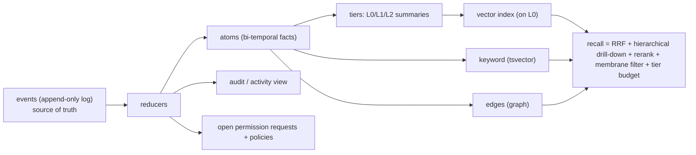

# Data Model — strawman (v0)

> A concrete **strawman** merging an *append-only event log*, *bi-temporal fact atoms + a membrane*, and *tiered L0/L1/L2 retrieval*. **This is a proposal to react to — not a decision.** §1–8 spec **Option A** (unified event log); a lighter **Option B** (versioned table + separate audit) and an **A/B comparison** are near the end — the single biggest fork (`QUESTIONS.md` **Q2/Q39**), specced both ways so the devs choose. The recall/tier/edge/membrane/trust-policy layers are **identical** in A and B. Types are illustrative (Postgres + TS-ish), not final DDL.

## Principles
1. **One append-only event log is the source of truth.** Atoms, audit, and indexes are all *projections* of it. Compaction/summarization changes a *projection*, never history.
2. **Split record from index.** The record (events → atoms) is deterministic/owned; vector/graph/tier indexes are rebuildable.
3. **The membrane is a column on every row** (`visibility`) enforced by RLS *below the model*, plus a recall-time filter.
4. **Bi-temporal** (a four-timestamp model): world-time (`valid_at`/`invalid_at`) separate from system-time (`created_at`/`expired_at`). Invalidate, never delete (except GDPR erasure).
5. **Tenancy on everything:** `owner_id` (the person) · `hello_id` (their hello = the DO) · optional `org_id`.



---

## 1. `events` — the append-only log (the spine)

```
events (
  id           uuid pk,
  seq          bigint,          -- monotonic per hello (high-water for prefix/replay)
  owner_id     uuid, hello_id uuid, org_id uuid null,     -- tenancy
  session_id   uuid, turn_id uuid null, request_id uuid null,  -- request_id links a permission handshake
  ts           timestamptz,
  category     event_category,  -- 'conversation' | 'trust' | 'memory' | 'integration' | 'system'
  kind         event_kind,      -- see enum below
  role         text,            -- 'user'|'model'|'tool'|'system'
  author       text,            -- 'user'|'host'|'agent'|'tool'|'integration'|'other_hello'
  visibility   visibility,      -- membrane, see enum
  payload      jsonb,           -- kind-specific
  refs         jsonb,           -- {source_url, message_id, atom_ids[], tool_name, ...}
  digest       bytea            -- canonical digest of (prev_digest + this row) → tamper-evidence
)  -- APPEND-ONLY: no UPDATE/DELETE. Immutable committed rows; streaming partials live elsewhere.
```

**`event_kind` enum (one stream, many kinds):**
- *conversation:* `user_message · model_message · thinking · tool_call · tool_result`
- *trust:* `permission_request · permission_decision · permission_accepted · termination`
- *memory:* `memory_assert · memory_supersede · memory_forget · memory_correct`
- *integration:* `ingest_observation · watch_event`
- *system:* `session_start · session_end · policy_changed`

**Trust payloads (illustrative):**
```ts
permission_request  = { tool, args, risk: 'low'|'med'|'high'|'irreversible', reason, untrustedArgs: string[] }
permission_decision = { requestId, decision:'allow'|'deny', reviewer, rationale?, rememberScope:'once'|'turn'|'always_for'|'never', rememberKey? }
termination         = { cause:'completed'|'failed'|'aborted'|'cancelled', endInvocation:true }
```
Replaying `request → decision → accepted` by `request_id` reconstructs the full approve-before-act handshake = **audit for free**. `rememberScope:'always_for'` writes into `policies` (§5).

> **Fork (Q39):** one unified log (above) vs. separate memory-log + runtime-log. Unified is elegant and shares tamper-evidence; separate decouples memory from the agent runtime. Devs' call.

---

## 2. `atoms` — bi-temporal fact projection (reduced from `memory_*` events)

```
atoms (
  id           uuid pk,
  owner_id, hello_id, org_id null,
  subject      text, predicate text, object jsonb,   -- a typed fact: (Mahesh, prefers_contact, "email")
  fact_text    text,                                 -- human/embeddable rendering
  valid_at     timestamptz, invalid_at timestamptz null,   -- world-time
  created_at   timestamptz, expired_at timestamptz null,   -- system-time
  visibility   visibility,                           -- the membrane
  confidence   real,
  salience     real,                                 -- for decay w/ a floor
  last_confirmed_at timestamptz,                      -- reinforce on CONFIRMATION, not retrieval
  status       atom_status,                          -- 'active'|'superseded'|'forgotten'
  supersedes   uuid null, superseded_by uuid null,   -- supersession chain
  provenance   uuid[]                                -- event ids (+ source spans in refs)
)
-- INDEX: (hello_id, visibility, predicate), and (owner_id, valid_at) — RLS needs tenant-leading composite indexes.
```
Reducer: `memory_assert` → new active atom; `memory_supersede` → close old (`invalid_at`/`expired_at`, `status=superseded`, link `superseded_by`) + open new; `memory_forget` → `status=forgotten` (tombstone, provenance kept) or GDPR crypto-shred. **Recall filters `status='active' AND invalid_at IS NULL`.**

## 3. `edges` — graph (multi-hop, gap #2)
```
edges ( id, owner_id, hello_id, from_atom uuid, to_atom uuid, relation text,
        valid_at, invalid_at null, provenance uuid[], visibility )
```
A relations table + recursive-CTE traversal — **not** Neo4j.

## 4. `tiers` — L0/L1/L2 (retrieval + budgeting, gaps #1/#4)
```
context_nodes ( id, hello_id, parent_id null, path text,   -- hierarchy for directory drill-down
  l0 text,        -- abstract ~256 chars   → embedded for vector search
  l1 text,        -- overview ~4000 chars  → rerank + navigation
  l2_ref jsonb,   -- pointer to atom(s)/source (loaded on demand)
  l0_embedding vector(N), freshness timestamptz, generated_by text )
```
Generated bottom-up on write; **vector search hits L0 only, rerank reads L1, L2 loads on demand** (~90% token savings). Recall drills the hierarchy with score propagation.

## 5. `policies`, `permission_requests`, `counters` — trust projections
```
policies ( id, owner_id, hello_id, scope jsonb,   -- {tool?, contact?, counterparty_hello?, action_class?}
  effect 'allow'|'deny', budget jsonb null, expires_at null, source_event uuid )
  -- the SHARED store: "always allow for Priya" (v1 Approvals) AND cross-hello autonomy policy (v3 Federation) live here.
permission_requests ( request_id pk, hello_id, tool, args jsonb, risk, status 'open'|'allowed'|'denied'|'expired', created_at, decided_event uuid null )  -- open queue = the Approvals inbox
counters ( hello_id, window, tokens_spent, actions_by_class jsonb, updated_at )  -- spend/action caps + circuit breaker
```

## 6. Read path (recall) & write path — pseudocode
```
recall(query, caller):
  q = embed(threaded(query))
  cands = RRF( vectorSearchL0(q), keyword(q), graphNeighbors(q) )     # multi-signal (Q37)
  cands = drillHierarchy(cands, score_propagation)                    # tiered drill-down
  cands = membraneFilter(cands, caller)                               # RLS + recall-time; private never leaks
  ranked = rerank(cands)[:budget]                                     # tier: hot block + retrieved + trimmed
  return withProvenance(ranked)

writeMemory(evidence):
  facts = extract(evidence)                                          # LLM → proposed events
  for f in facts:
    action = reconcile(f, topK(f))                                   # ADD|UPDATE|DELETE|NOOP
    if lowConfidence(f): enqueueReview(f); continue                  # → "memory health", default private
    appendEvent(memory_event(action, f))                            # UPDATE emits memory_supersede
  # async: reduce → atoms → regenerate tiers → reindex
```

## 7. Membrane / RLS (Q3)
`ENABLE` + `FORCE ROW LEVEL SECURITY` on `events`, `atoms`, `edges`, `context_nodes`, policies. App connects as a **non-owner role**; tenant context via **`SET LOCAL`** per transaction (never `SET`). Policy: readable iff `owner_id = current_user_id()` **OR** (`visibility='org:'||org_id` AND membership) **OR** (`visibility='shared'` AND same hello-graph). Cross-hello (A2A) exposes only `shared`+ atoms — **private atoms never cross a hello boundary**, checked below the model. Prove it in CI (wrong tenant → 0 rows).

## 8. Where each surface reads/writes
- **Memory view / edit / forget** → `atoms` (read) + append `memory_*` events (write). **Time-machine** = reduce events `WHERE created_at <= T`.
- **People** → `atoms` (entity subjects) + `edges`. **Commitments** → `atoms WHERE predicate∈commitment set`.
- **Approvals inbox** → `permission_requests WHERE status='open'`; **decision** appends a `permission_decision` event; **"always allow"** writes `policies`. **Activity/receipts** → the `events` log.
- **Membrane control** → edits `atoms.visibility` (append a `memory_correct`); **Connections scope** sets default visibility on ingest.
- **Federation autonomy** → reads `policies` (same store as Approvals).

---

# Option B — versioned bi-temporal table (the lighter variant, red-team's lean)

Everything in §1–8 above is **Option A** (unified append-only event log = source of truth). **Option B keeps the same user-facing capabilities** — versioning, time-travel, correction, provenance, inspect/edit/forget, the membrane — but drops the event-sourcing machinery: the **`atoms` table *is* the record** (written directly, versioned in place), and a **separate, simple append-only audit log** covers trust/actions only. Same capabilities, far less to build and operate.

### B.1 `atoms_history` — system-versioned temporal table (the record)
```
atoms_history (
  atom_id uuid, version int,
  owner_id, hello_id, org_id,
  subject, predicate, object jsonb, fact_text,
  valid_at, invalid_at,        -- world-time
  created_at, expired_at,      -- system-time (row supersede)
  visibility, confidence, salience, last_confirmed_at,
  status 'active'|'superseded'|'forgotten', supersedes uuid,
  provenance jsonb,            -- {source, spans, asserted_by}
  primary key (atom_id, version)
)
-- "current" = a (materialized) view WHERE expired_at IS NULL AND status='active'.
-- edit    = INSERT a new version + set prior row's expired_at (never mutate in place).
-- forget  = new version status='forgotten' (tombstone) OR crypto-shred for GDPR.
-- time-travel ("believed when") = SELECT ... WHERE created_at <= :T  (as-of query).
```
Implementation choices: a hand-rolled history table (above), a Postgres temporal/`periods` extension, or `pgroll`-style versioning. **No reducer, no projection rebuilds.**

### B.2 `audit` — trust/actions only, separate & simple
```
audit ( id, seq, hello_id, ts,
  kind 'tool_call'|'permission_request'|'permission_decision'|'termination',
  request_id, payload jsonb, digest )
-- Same payload shapes + requestId handshake (§1) — Approvals inbox + receipts read this.
-- But it does NOT carry memory changes; memory history lives in atoms_history.
```

### B.3 Shared with Option A (unchanged either way)
`edges`, `context_nodes` (L0/L1/L2 tiers), vector/keyword indexes, `policies`, `permission_requests`, `counters`, the whole **recall + write path**, and **RLS/membrane**. **The fork is ONLY the record layer** — recall quality, tiers, the membrane, and trust policies are identical in A and B.

## A vs B — side by side

| Dimension | **A — unified event log** | **B — versioned table + separate audit** |
|---|---|---|
| Build & ops complexity | Higher (reducer, projections, rebuilds) | **Lower** (plain Postgres, no rebuilds) |
| Time-travel / "believed when" | Yes (replay to seq) | Yes (as-of query) |
| Correction / supersession | Yes (events) | Yes (row versions) |
| GDPR hard-delete | **Hard** (immutable log → crypto-shred) | **Easier** (delete/rewrite history rows) |
| Tamper-evidence | **Strong** (digest chain over memory + trust) | Audit table only (trust) |
| Memory + trust share one spine | **Yes** (elegant) | No (two simple stores) |
| Replay/debug to any point | Strong | Moderate (as-of queries) |
| Who can operate it | Fewer engineers comfortable | **Every Postgres engineer** |
| Coupling | Memory coupled to runtime | **Decoupled** |
| You give up… | Simplicity | A single tamper-evident spine across memory+trust |

## How to choose (framing, not a decision)
- **Pick B if:** pre-PMF, small team, ship fast, GDPR-delete matters early, no regulatory-audit need yet. *(This is the red-team's lean and honours "don't hand-roll event sourcing," Q2.)*
- **Pick A if:** you specifically need one tamper-evident audit spine across **memory AND actions** (enterprise/compliance, or to make the autonomous-federation trust story bullet-proof) — and have the eng depth.
- **The likely sweet spot (already = Option B):** versioned table for **memory** + an append-only **audit** log for **trust only**. Simplicity where memory needs it; a strong, replayable trust record where safety needs it. Recommend starting here and only moving memory to full event-sourcing if a concrete need appears.

## 9. Open questions (to devs)
Q2 (this whole event-log vs a simpler versioned bi-temporal table — the strawman is the heavier end; the table variant keeps atoms + bitemporal, drops the unified log, uses events only for audit) · Q36 (atoms + tiers vs filesystem-native) · Q37 (RRF default) · Q39 (unified vs split logs) · Q3 (RLS specifics) · Q16 (GDPR crypto-shred on the immutable log).

*All patterns here are reimplemented from general prior art; no third-party code is vendored (some studied prior art is copyleft).*
